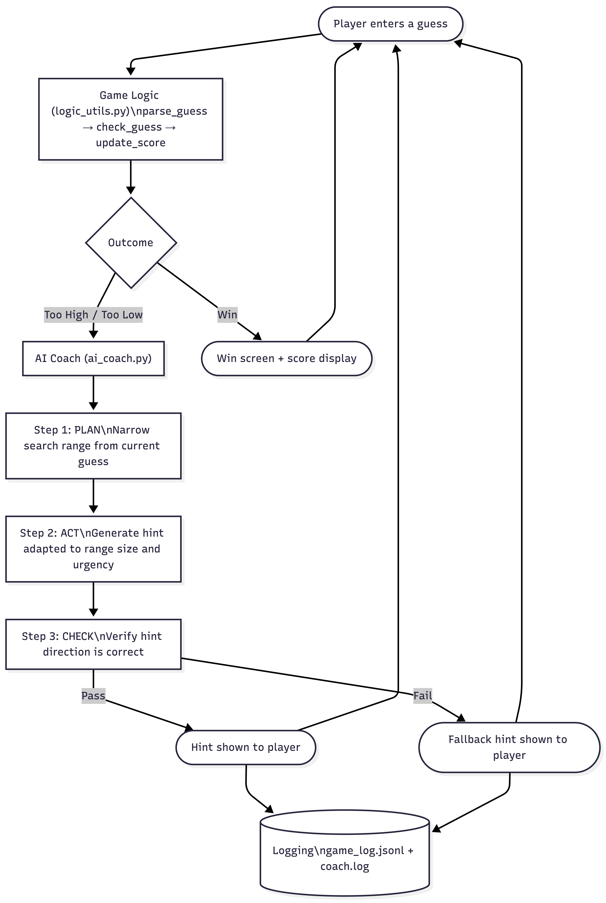

# AI-Powered Number Guessing Coach

## Original Project

This project extends **Game Glitch Investigator** (Module 1), a Streamlit number guessing game that was intentionally broken with three bugs: a state reset bug that changed the secret number on every click, reversed hint logic ("Too High" / "Too Low" were backwards), and an off-by-one error in the attempt counter. The original project's goal was to debug and fix those issues, then refactor the game logic into a testable utility module (`logic_utils.py`).

---

## Summary

The AI-Powered Number Guessing Coach adds a reasoning agent on top of the fixed game. Instead of receiving a flat "Too High" or "Too Low" message after each guess, players get a personalized, strategic hint generated by an agentic loop that analyzes their accumulated guess history, generates a coaching message, and then verifies its own output before showing it. The agent adapts its message based on how much of the range has been eliminated and how many attempts the player has left.

---

## System Diagram



---

## Architecture Overview

The system has three layers:

**UI layer** (`app.py`) — Streamlit handles player input, game state via `st.session_state`, and rendering. It also tracks the accumulated narrowed range (`current_low`, `current_high`) across guesses, resetting on each new game.

**Game logic layer** (`logic_utils.py`) — Pure Python functions for parsing input, evaluating guesses, and computing scores. These are deterministic and fully unit-tested.

**AI coach layer** (`ai_coach.py`) — A three-step agentic reasoning loop:
- **Plan**: Applies the current guess outcome to the accumulated range to compute a newly narrowed range and the optimal next guess (midpoint).
- **Act**: Generates a strategic coaching message that adapts based on range size (fewer remaining options = more specific advice) and urgency (fewer attempts = more direct guidance).
- **Check**: Verifies the generated hint is directionally consistent with the outcome. If the check fails, a safe fallback hint is used.

Every step is logged to `game_log.jsonl` (structured, one JSON object per line) and `coach.log` (human-readable). If an unexpected error occurs, the game falls back gracefully to the basic "Too High / Too Low" message so gameplay is never interrupted.

---

## Setup Instructions

### 1. Clone the repository

```bash
git clone <your-repo-url>
cd applied-ai-system-final
```

### 2. Install dependencies

```bash
pip install -r requirements.txt
```

### 3. Run the app

```bash
python -m streamlit run app.py
```

### 4. Run the tests

```bash
pytest tests/ -v
```

No API key or external accounts required.

---

## Sample Interactions

### Example 1 — First guess, large range remaining

**Difficulty:** Normal (1–100) | **Attempts left:** 7
**Player guesses:** 50 | **Result:** Too Low

**AI Coach output:**
> "Too low! The number must be between 51 and 100 (50 possibilities). Try 75 to cut the remaining range in half."

---

### Example 2 — Two guesses in, closing in

**Previous guesses:** 50 (Too Low) → range updated to 51–100
**Player guesses:** 75 | **Result:** Too High | **Attempts left:** 6

**AI Coach output:**
> "Too high! You've eliminated 75% of the range. The number is between 51 and 74 — try 62 next."

---

### Example 3 — Almost there, tight range

**Previous guesses:** 50 (Too Low), 75 (Too High), 62 (Too Low), 68 (Too High)
**Player guesses:** 65 | **Result:** Too Low | **Attempts left:** 3

**AI Coach output:**
> "Too low! You've narrowed it to just 5 possibilities: [66, 67, 68, 69, 70]... wait — you're almost there!"

*(When the remaining range drops to 5 or fewer, the coach lists every remaining option.)*

---

## Design Decisions

**Why a 3-step agentic loop instead of one function?**
Splitting plan, act, and check into separate steps makes each step's responsibility clear and independently testable. The check step is the most important — it catches cases where the generated hint accidentally contradicts the actual outcome. Separating it means the verification logic can be updated independently without touching the hint-generation logic.

**Why track the narrowed range in session state?**
Without accumulated state, the coach would only know the current guess's outcome, not the full history. By updating `current_low` and `current_high` after every guess, the Plan step starts from the true narrowed range rather than the original difficulty range — so by guess 4 or 5, the hints are much more precise.

**Why adapt hints by range size and attempts left?**
A hint saying "try 62 next" is useful when 50 options remain, but unhelpful noise when only 3 options remain. The Act step has four message tiers (1 option, ≤5 options, ≤2 attempts left, ≤4 attempts left, and the general case) so the coaching feels relevant rather than robotic.

**Why fall back to the basic hint instead of raising an error?**
The game should always be playable. The coach is an enhancement, not a dependency. If the check step fails or an unexpected error occurs, the original "Too High / Too Low" behavior kicks in automatically.

**Why `game_log.jsonl` for logging?**
Newline-delimited JSON is easy to inspect, grep, and parse without any infrastructure. Each line is a self-contained record with timestamp, step, inputs, and outputs — enough to reconstruct what happened in any session.

---

## Testing Summary

**Unit tests (pytest):** 5 out of 5 tests pass. Tests cover win detection, Too High, and Too Low cases for `check_guess`. A pre-existing bug was found and fixed during this project — the original tests compared `check_guess` output against a plain string, but the function returns a `(outcome, message)` tuple. Tests were updated to unpack the tuple correctly.

**Agentic check step:** The `_check` function scans the generated hint for directional keywords consistent with the outcome. During development this caught edge cases where the Act step produced an ambiguous message (e.g., a generic "keep going" hint that didn't clearly tell the player which direction to move).

**Logging coverage:** Every step of the agentic loop — plan, act, check, and any errors — is recorded in `game_log.jsonl`. After a test session, each guess is traceable: what range was passed in, what the plan computed, what hint was generated, and whether it passed verification.

**What didn't work initially:** The first version of the Plan step computed the narrowed range from only the current guess, without carrying forward previous guesses. This meant the hint after guess 5 was barely better than after guess 1. Adding `current_low`/`current_high` to session state fixed this — the coach now gives progressively more precise advice as the game continues.

---

## Reflection and Ethics

### Limitations and biases

The coach's advice assumes optimal binary-search play. It always suggests the midpoint of the remaining range. This is mathematically correct but might feel robotic. A human coach might consider the psychological tendency to guess round numbers and account for that. The system also has no memory across games; it cannot learn that a particular player tends to guess too high and adjust accordingly.

### Could this be misused?

A number guessing game coach has minimal misuse potential. The main risk in a deployed version would be API abuse if the app were hosted publicly, but since this version requires no external API, that concern doesn't apply. More generally, agentic systems that modify state (like the session state updates here) should be careful not to corrupt game state on errors; the try/except with fallback handles this.

### What surprised you while testing?

The biggest surprise was how useless the hints were before I added the accumulated range tracking. In the first version, the coach said something like "the number must be between 1 and 100" on guess 6, the same thing it said on guess 1. It looked like a coaching system but wasn't doing anything. Once `current_low` and `current_high` were tracked in session state, the hints got specific within a few guesses and actually felt helpful. It was a good reminder that a feature that looks integrated isn't necessarily working.

### Collaboration with AI during this project

**Helpful:** Claude suggested storing the narrowed range in session state and updating it after each guess, rather than passing the original difficulty range every time. That single change is what made the coach actually useful, before it, the Plan step had no accumulated knowledge to work with, just the current guess and the full original range.

**Flawed:** Claude's first version of the coach was built around the Anthropic API, which required a paid API key I didn't have. The whole design had to be rebuilt from scratch as a rule-based system. It also left in a `with st.spinner("Coach is thinking...")` block that made sense for an API call but just flashed for a millisecond in the rule-based version and looked like a bug. I had to catch and remove it — same lesson as before: accept AI suggestions as a starting point, not a finished answer.

---

## Demo

🎥 **Walkthrough video:** [Watch on Loom](https://www.loom.com/share/949cde37799345b2b24df3604600e071)

---

## Portfolio

This project shows that I can take something broken, fix it properly, and then extend it into a real system — not just by adding features, but by thinking about how components communicate, how errors are handled, and how to make the AI's behavior traceable. Building the agentic loop and logging taught me that reliability isn't something you add at the end; it has to be part of the structure from the start. I want to keep building that way.
