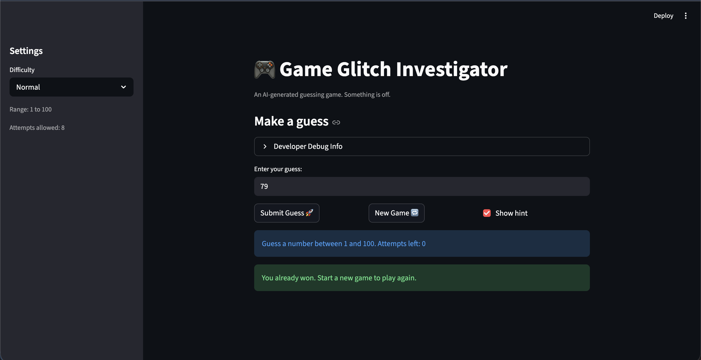

# 🎮 Game Glitch Investigator: The Impossible Guesser

## 🚨 The Situation

You asked an AI to build a simple "Number Guessing Game" using Streamlit.
It wrote the code, ran away, and now the game is unplayable. 

- You can't win.
- The hints lie to you.
- The secret number seems to have commitment issues.

## 🛠️ Setup

1. Install dependencies: `pip install -r requirements.txt`
2. Run the broken app: `python -m streamlit run app.py`

## 🕵️‍♂️ Your Mission

1. **Play the game.** Open the "Developer Debug Info" tab in the app to see the secret number. Try to win.
2. **Find the State Bug.** Why does the secret number change every time you click "Submit"? Ask ChatGPT: *"How do I keep a variable from resetting in Streamlit when I click a button?"*
3. **Fix the Logic.** The hints ("Higher/Lower") are wrong. Fix them.
4. **Refactor & Test.** - Move the logic into `logic_utils.py`.
   - Run `pytest` in your terminal.
   - Keep fixing until all tests pass!

## 📝 Document Your Experience

**Game purpose:**
A number guessing game where the player tries to guess a secret number within a limited number of attempts. The difficulty setting controls the number range and attempt limit. After each guess the game gives a "Too High" or "Too Low" hint to guide the player toward the answer.

**Bugs found:**
- The New Game button did not work — after a win or loss the game stayed frozen and would not reset.
- The hints were backwards — "Too High" appeared when the guess was too low, and vice versa.
- The attempt counter stopped at 1 instead of counting all the way down to 0.

**Fixes applied:**
- Added `st.session_state.status = "playing"` inside the New Game block so the game state resets properly on each new round.
- Corrected the comparison logic in `check_guess` in `logic_utils.py` so higher guesses return `"Too High"` and lower guesses return `"Too Low"`.
- Fixed the initial attempts value from `1` to `0` and adjusted the counter display with `- (1 if submit else 0)` to account for Streamlit's render timing.

## 📸 Demo

# on mac I had to do cmd+click to open the png file.

- [ ] [If you choose to complete Challenge 4, insert a screenshot of your Enhanced Game UI here]
